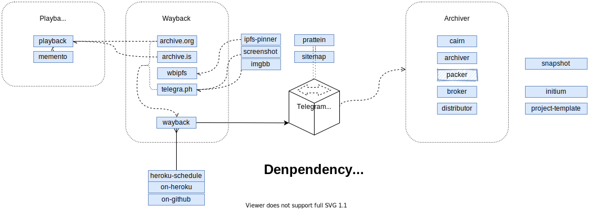

# Initium for Wayback Archiver

> "initium" in Latin,  Wayback Archiver documentation repo

This repository is a *work in progress*.

Indiscriminate Censor's Hand is the starting point of the Wayback Archiver.
It aims to make the Wayback Machine easier to use and focus on information dissemination.

This organization is a place to bring together all of the Wayback Archiver repositories,
and to work together on making it better. This repository is the center of that organization.

## Table of Contents

<!-- START doctoc generated TOC please keep comment here to allow auto update -->
<!-- DON'T EDIT THIS SECTION, INSTEAD RE-RUN doctoc TO UPDATE -->

- [How it works](#how-it-works)
- [Repositories](#repositories)
  - [Code-free repositories](#code-free-repositories)
  - [Wayback Archiver](#wayback-archiver)
  - [Modules](#modules)
- [Registries](#registries)
- [License](#license)

<!-- END doctoc generated TOC please keep comment here to allow auto update -->

## How it works

## Repositories

The [Wayback Archiver](https://github.com/wabarc) organization on GitHub contains many different repositories.
For the most part, these fall into three categories:

1. Wayback, wayback webpages to the Wayback Machine, and the decentralized web;
2. Archiver, archiving and store webpages to third-party repositories;
3. Various non-code repositories.

### Code-free repositories

- The [initium](https://github.com/wabarc/initium) documentation repo, which you're in right now.
- [project-template](https://github.com/wabarc/project-template), which is a template for creating a code repository.

### Wayback Archiver

- [wayback](https://github.com/wabarc/wayback) - The main repo for wayback and publish the messages.
- [archiver](https://github.com/wabarc/archiver) - Archiving webpages from the published messages by `Wayback Bot`.

### Modules

- [archive.org](https://github.com/wabarc/archive.org) - A Golang package for request [Internet Archive](https://archive.org/) to archive webpages.
- [archive.is](https://github.com/wabarc/archive.is) - A Golang package for request [Archive.today](https://archive.today/) to archive webpages.
- [broker](https://github.com/wabarc/broker) - Distribute webpages to the third party repository.
- [cairn](https://github.com/wabarc/cairn) - A JavaScript library for snapshot webpages written in TypeScript. The most important module used by *archiver*.
- [distributor](https://github.com/wabarc/distributor) - GitHub actions for distributing webpages using *broker*.
- [imgbb](https://github.com/wabarc/imgbb) - A command-line tool and Go package interface for upload images to [ImgBB](https://imgbb.com).
- [ipfs-pinner](https://github.com/wabarc/ipfs-pinner) - Pin file to IPFS pinning service, required by [wbipfs](https://github.com/wabarc/wbipfs).
- [packer](https://github.com/wabarc/packer) - Part of the module required by *archiver* using to pack webpages to file, inherits from [archiver](https://github.com/wabarc/archiver).
- [screenshot](https://github.com/wabarc/screenshot) - Capture webpage and save as image using chromedp.
- [telegra.ph](https://github.com/wabarc/telegra.ph) - A command-line tool and Go package interface for wayback webpage to [Telegraph](https://telegra.ph).
- [wbipfs](https://github.com/wabarc/wbipfs) - A Golang package and CLI tool to transfer file to IPFS.

Other repositories include:

- [snapshot](https://github.com/wabarc/snapshot) - A Golang package and CLI for snapshot webpages using chromedp.
- [prattein](https://github.com/wabarc/prattein) - Website for `Wayback Bot` published messages, alias Telegram channel.
- [sitemap](https://github.com/wabarc/sitemap) - Generate sitemap for [prattein](https://github.com/wabrac/prattein).
- [on-heroku](https://github.com/wabarc/on-heroku) - Which is a script tool to deploy *wayback* service as heroku app.
- [on-github](https://github.com/wabarc/on-github) - Host *wayback* service on GitHub using Actions.
- [heroku-schedule](https://github.com/wabarc/heroku-schedule) - Scheduling for the Heroku app using GitHub Actions.
- [helper](https://github.com/wabarc/helper) - Helper functions for Golang projects.
- [golang-chromium](https://github.com/wabarc/golang-chromium) - Docker image bundling Golang and Chromium.
- [githooks](https://github.com/wabarc/githooks) - Git hooks for development.

## Registries

Wayback Archiver accounts are also maintained on these registries:

- [GitHub @wabarc](https://github.com/wabarc)
- [GitLab @wabarc](https://gitlab.com/wabarc)
- [npm @wabarc](https://www.npmjs.com/org/wabarc)
- [DockerHub @wabarc](https://hub.docker.com/u/wabarc)

## License

This repository is only for documents. All of these are licensed under the Creative Commons Zero v1.0 Universal license, see the [LICENSE](https://github.com/wabarc/initium/blob/main/LICENSE) file for details.

